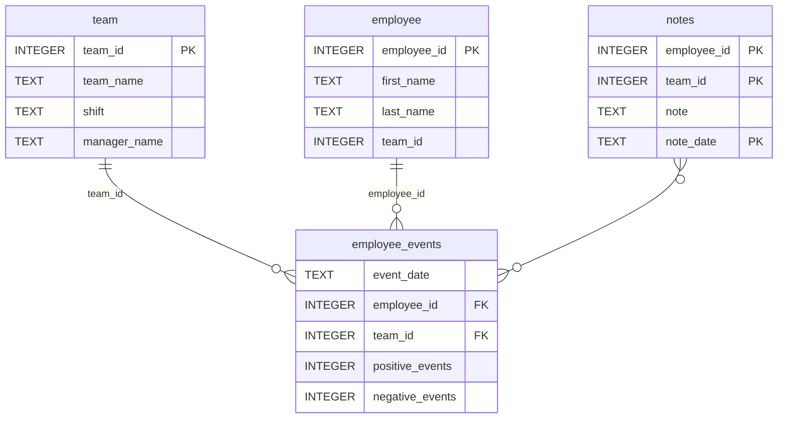

# Important Note
**Main** branch is for project submission. All other branches are for development purposes only.

# Software Engineering for Data Scientists 

This repository contains starter code for the **Software Engineering for Data Scientists** final project. Please reference your course materials for documentation on this repository's structure and important files. Happy coding!

## Project setup
1. Fork and Clone this repository to your environment.
2. Make a virtual environment and activate following the command below
```bash
python -m venv venv
(For Windows Users)
venv/Scripts/activate

(For Linux/MacOS Users)
source venv/bin/activate
```
3. Move to python-package directory from root directory, and install local-defined packages following the commands below.
  ```bash
  cd python-package
  pip install -e .
  ```
4. Then back to root directory following the command below.
```bash
cd ..
```
5. Install required remote packages following the command below.
```bash
pip install -r requirements.txt
```
6. Let's open our app!
```bash
python report/dashboard.py
```
 
### Repository Structure
```
├── README.md
├── assets
│   ├── model.pkl
│   └── report.css
├── env
├── python-package
│   ├── employee_events
│   │   ├── __init__.py
│   │   ├── employee.py
│   │   ├── employee_events.db
│   │   ├── query_base.py
│   │   ├── sql_execution.py
│   │   └── team.py
│   ├── requirements.txt
│   ├── setup.py
├── report
│   ├── base_components
│   │   ├── __init__.py
│   │   ├── base_component.py
│   │   ├── data_table.py
│   │   ├── dropdown.py
│   │   ├── matplotlib_viz.py
│   │   └── radio.py
│   ├── combined_components
│   │   ├── __init__.py
│   │   ├── combined_component.py
│   │   └── form_group.py
│   ├── dashboard.py
│   └── utils.py
├── requirements.txt
├── start
├── tests
    └── test_employee_events.py
```

### employee_events.db


